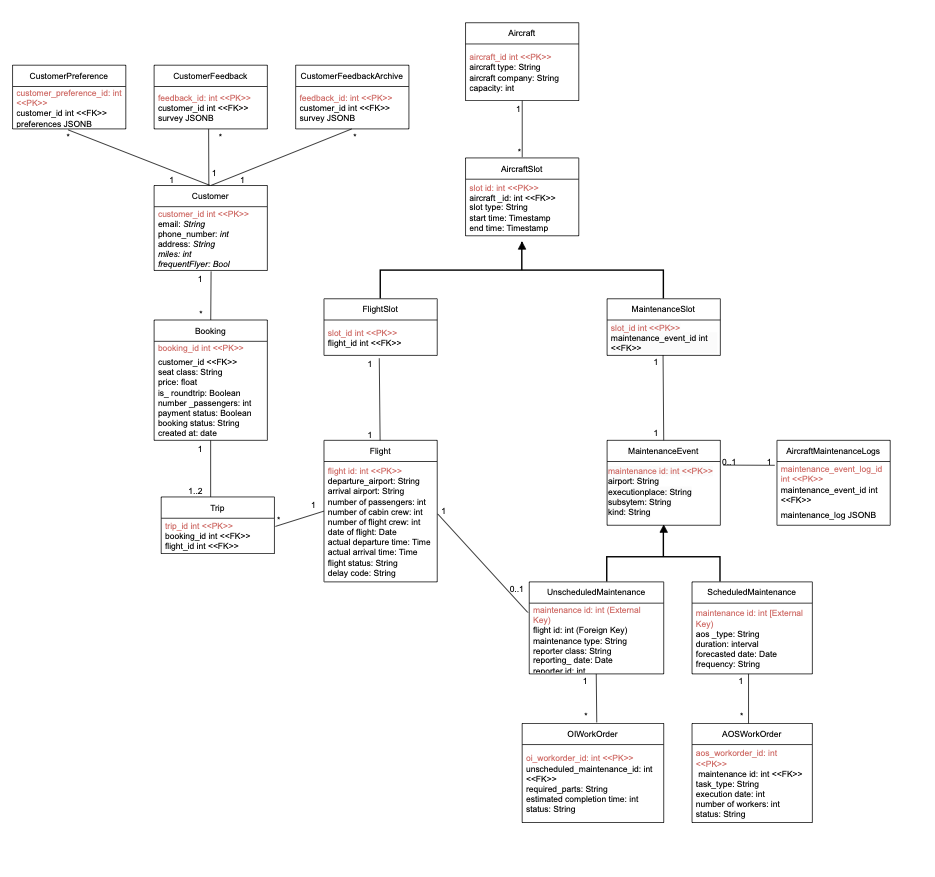

# Data Management - Assignment 2



## Instructions for Running Files

Follow these steps to set up the database, generate fake data, and run the necessary queries for each part of the assignment.

1. **Generate the original data model**  
    Run the following SQL file to create the initial tables and schema:
    ```bash
    psql -U <username> -d <database> -f assignment_1_model.sql
    ```
2. **Create additional tables with JSON columns** 
    Run the following SQL file to add tables containing JSON columns:
    ```bash
    psql -U <username> -d <database> -f assignment_2_part_2a.sql
    ```

3. **Generate fake data**   
    Open and run FakeData_DataManagement.ipynb in Jupyter Notebook to generate fake data for all of the tables.

4. **Run queries for Assignment 2, Part 1**
    Execute the following SQL file to run queries for the first part of Assignment 2:
    ```bash
    psql -U <username> -d <database> -f assignment_2_part_1.sql
    ```

5. **Run queries for Assignment 2, Part 2**
    Execute the following SQL file to run queries for the second part of Assignment 2:
    ```bash
    psql -U <username> -d <database> -f assignment_2_part_2b.sql
    ```

6. **Run queries for Assignment 2, Part 3**
    Finally, run the following SQL file to execute queries for the third part of Assignment 2:
    ```bash
    psql -U <username> -d <database> -f assignment_2_part_3.sql
    ```

**Notes**
- Replace <username> and <database> with your PostgreSQL username and database name.
- Make sure the PostgreSQL server is running and accessible.
- The FakeData_DataManagement.ipynb file requires Python and the necessary libraries (e.g., Faker) to be installed in your environment.
